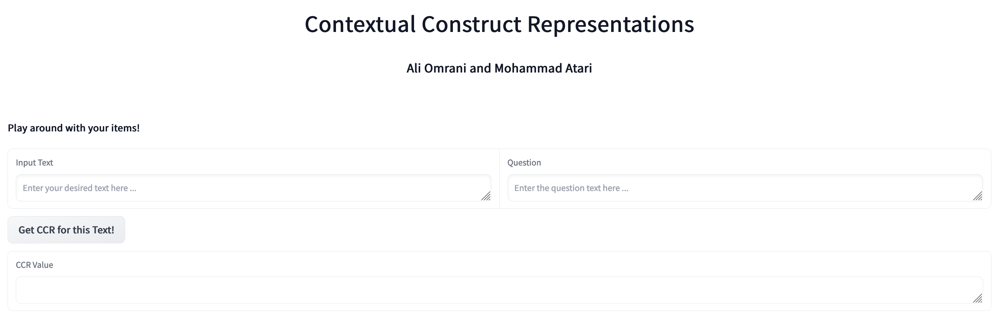

# Contextualized Construct Representations (CCR)


## Introduction

This package is an implementation of our new method for theory-driven
psychological text analysis named Contextualized Construct
Representations (CCR). For more information, read the preprint or email
Mohammad Atari \[<matari@fas.harvard.edu>\] or Ali Omrani \[<aomrani@usc.edu>\]. Here, we will briefly
outline how CCR works; its implementation can be summarized in 5 steps
as follows:

1.  Specify a psychological construct of interest that needs to be
    measured in textual data (e.g., individualism).

2.  Select a psychometrically validated self-report measure for the
    construct of interest (e.g., The 6-item Individualism Scale).

3.  Represent self-report items as embeddings using contextualized
    language models (e.g., BERT).

4.  Represent the text to be analyzed using contextualized language
    models (e.g., BERT).

5.  Compute the similarity between the representation of text and those
    of psychometric scale items (e.g., using cosine similarity) to
    arrive at a set of “loading” scores. The higher this similarity, the
    higher the text scores on the construct of interest.


<p align="center"><font size="+3">
<a href="https://huggingface.co/spaces/Ali-Omrani/CCR"> CCR Demo</a>
</font>  </p>




CCR can be used in  
- [Online Tool](https://huggingface.co/spaces/Ali-Omrani/CCR)
- [R Package](#ccr-r-package) 
- [Python Package](#ccr-python-package)

# CCR R Package

## Installation

The original functions for CCR were implemented. This is a direct
translation into R using the following packages: tidyverse (data
manipulation), lsa (cosine similarity), and huggingfaceR (modeling). You
can install the development version of CCR from
[GitHub](https://github.com/) with:

``` r
# install.packages("devtools")
devtools::install_github("tomzhang255/CCR")
```

Note that this package automatically installs Miniconda and
<https://github.com/farach/huggingfaceR> in the background.

## Usage

Here is a simple example of how to use the main function:

``` r
res <- ccr_wrapper("data/d.csv", "d", "data/q.csv", "q")
#> Warning in validate_col_item_length(df, file_name, col_name, col_type): 1 rows from column q in data/q.csv have only 2 or 3 words. Row indices: 1
#> Warning in validate_col_item_length(df, file_name, col_name, col_type): 1 rows from column d in data/d.csv have less than 4 words. Row indices: 1
res
#>                          q                           d sim_item_1 sim_item_2
#> 1        Here's a question            Here's an answer  0.7191870  0.4478848
#> 2 This is another question We have yet a second answer  0.3696336  0.4954454
#> 3    A third question here        A third answer there  0.4685105  0.4422214
```

In particular, “data/d.csv” is the path (the complete address, absolute
or relative, including .csv; in this case, the file resides in the root
directory of our R project, so “data/d.csv” is the relative path) to the
file containing text data to be analyzed (e.g., user response to the
questionnaires; this could be open-ended text or tweets). This function
supports excel files as well (.xls, .xlsx). “d” would then be the name
corresponding to the column in “data/d.csv” containing said data.
Similarly, “data/q.csv” is the file path for the questionnaire (i.e.,
the validated psychometric scale to use). And “q” would be the column in
“data/q.csv” that contains these questionnaire items. Note that the file
names can also be substituted with R data frame objects, if the user has
already imported their data.

The output of the function is a data frame of identical structure as
“data/d.csv” but with a few extra columns appended. The number of these
extra columns equals the number of questionnaire items. The values of
the columns are cosine similarity scores between each text item and
questionnaire item.

By default, the function uses the language model named
“all-MiniLM-L6-v2” (Wang, Wenhui, et al., 2020); however, the user can
specify any model of their choice with the “model” argument in
ccr_wrapper(). See a complete list of all possible models on
<https://huggingface.co/models>.

# CCR Python Package

# Installation

- Make sure you have [Anaconda](https://www.anaconda.com/).

- Create a conda environment for CCR

```
conda create --name ccr python==3.9
```

- Activate the environment and install CCR module
```
conda activate ccr
pip install pyccr
```


## Usage

```python
from ccr import *
ccr_result_dataframe = ccr.ccr_wrapper(user_data_file, data_col, questionnaire_file, question_col)
```


